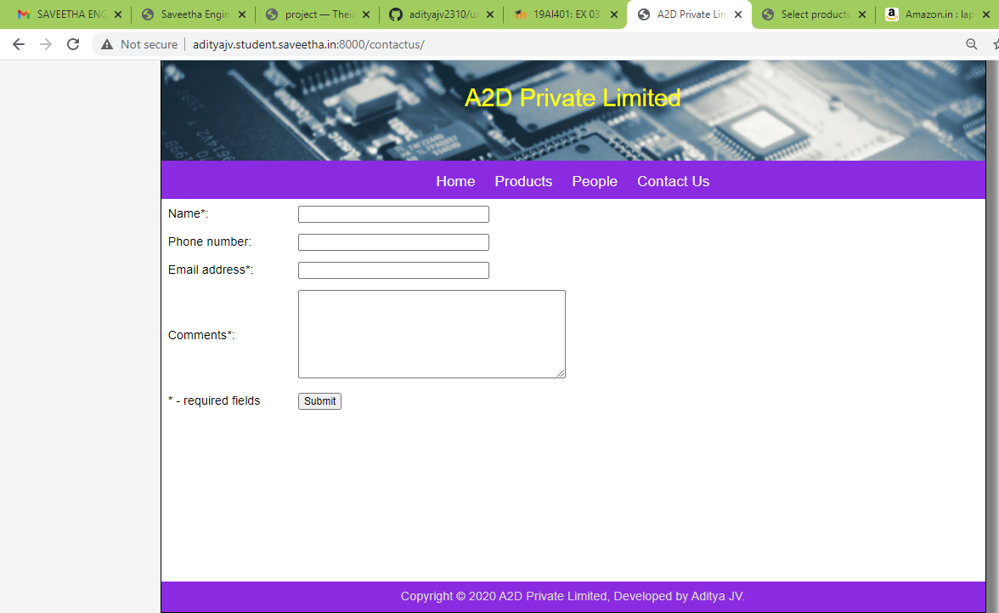

# Dynamic Website Design for a Manufacturing Company
## AIM:
To design a dynamic website for a chip manufacturing company.

## DESIGN STEPS:
### Step 1: 
Requirement collection.
### Step 2:
Creating the layout using HTML and CSS.
### Step 3:
Updating the sample content.
### Step 4:
Choose the appropriate style and color scheme.
### Step 5:
Validate the layout in various browsers.
### Step 6:
Validate the HTML code.
### Step 7:
Create a database model and migrate the database.
### Step 8:
Retrieve data from database and display it in a dynamic webpage.
### Step 9:
Publish the website in the given URL.

## PROGRAM:

### products.html
~~~



    
    
    <h1>Our Premium Products</h1>
    

        
        
 
            

            
            

            
{{ products.itemname }}

            
{{ products.itemprice }} 

        

        
    

    


~~~

### people.html
~~~



    

    <h1>Our Team</h1>
    

        
        

            

                
            

            
{{ people.membername }}

            
{{ people.designation }}

        

        
    

    


~~~

### views.py
~~~
from django.shortcuts import render
from .models import Products
from .models import People

# Create your views here.

def home(request):
    context = {}
    return render(request, 'dynamicwebsite/home.html', context)

def products(request):
    context = {}
    context["products"] = Products.objects.all()
    return render(request, 'dynamicwebsite/products.html', context) 

def people(request):
    context = {}
    context["people"] = People.objects.all()
    return render(request, 'dynamicwebsite/people.html', context)

def contactus(request):
    context = {}
    return render(request, 'dynamicwebsite/contactus.html', context)
~~~

## OUTPUT:

## RESULT:
Thus a dynamic website is designed for the chip manufacturing company and is hosted in the URL http://adityajv.student.saveetha.in:8000/. HTML code is validated.